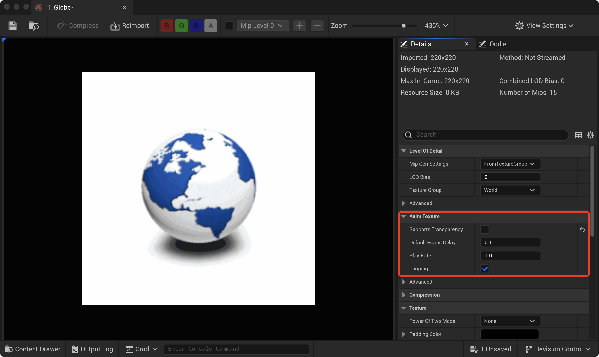
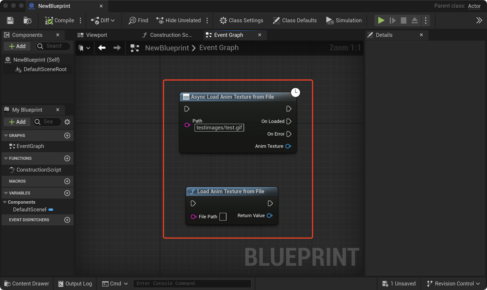
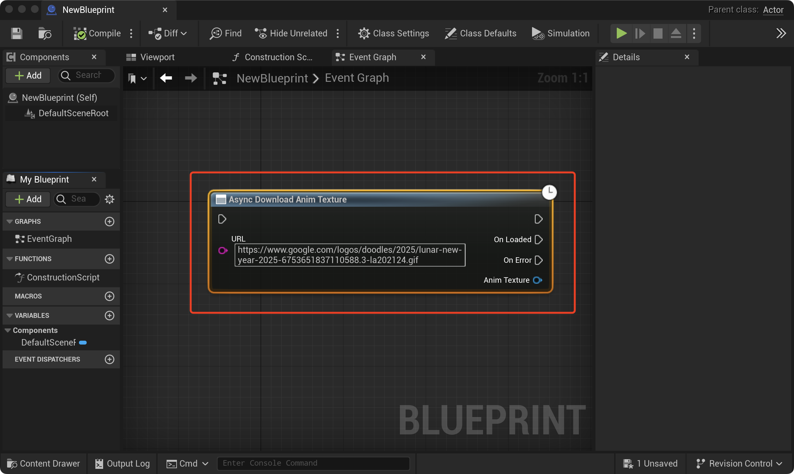
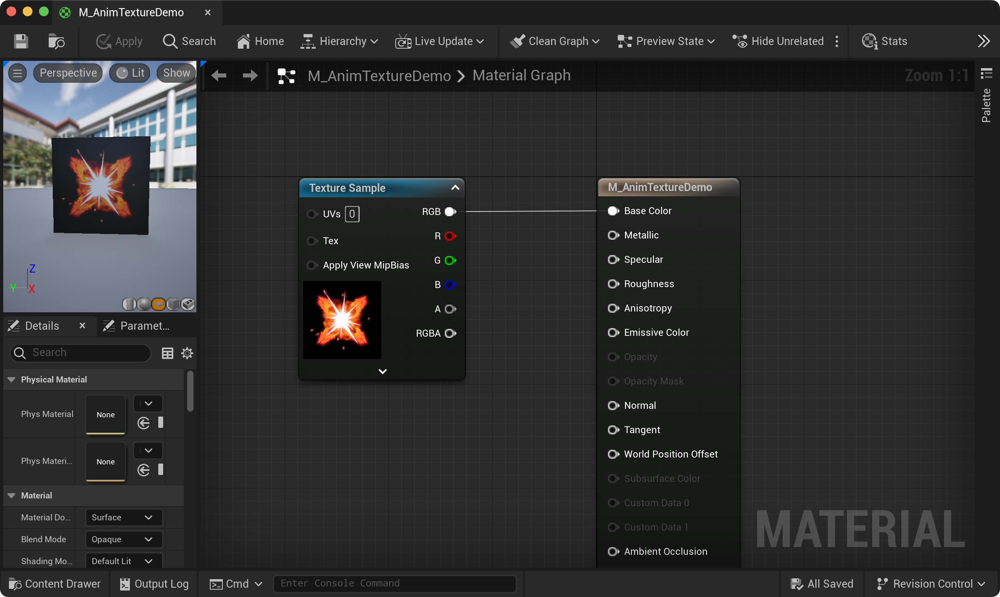
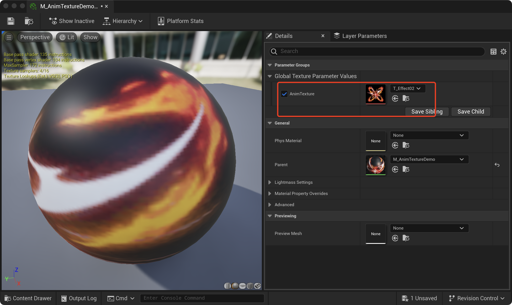
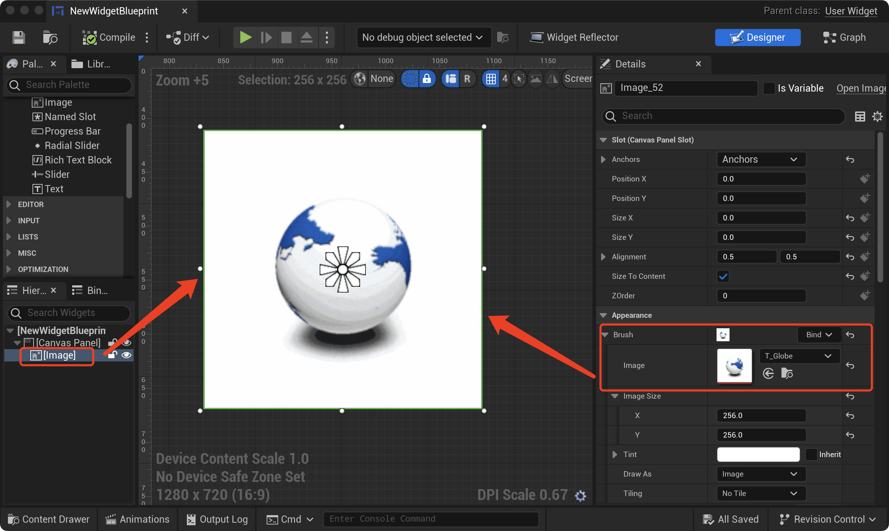
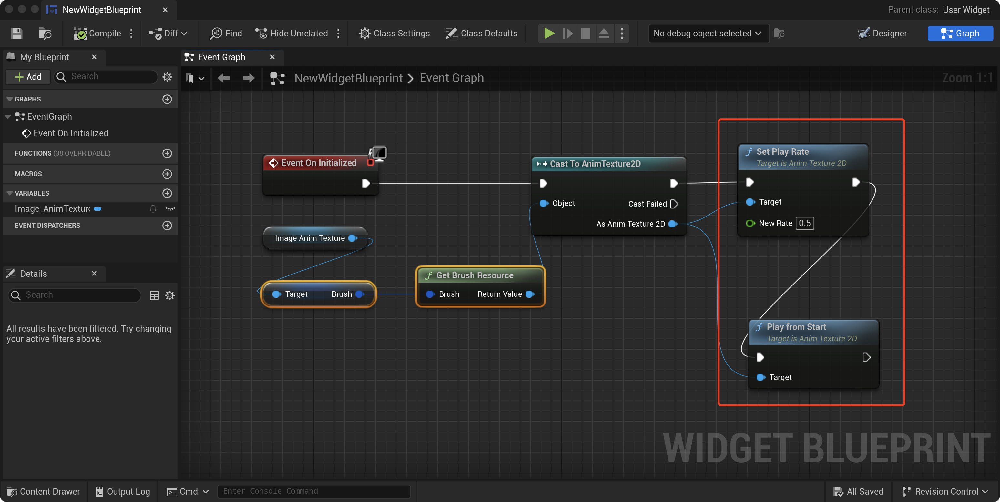
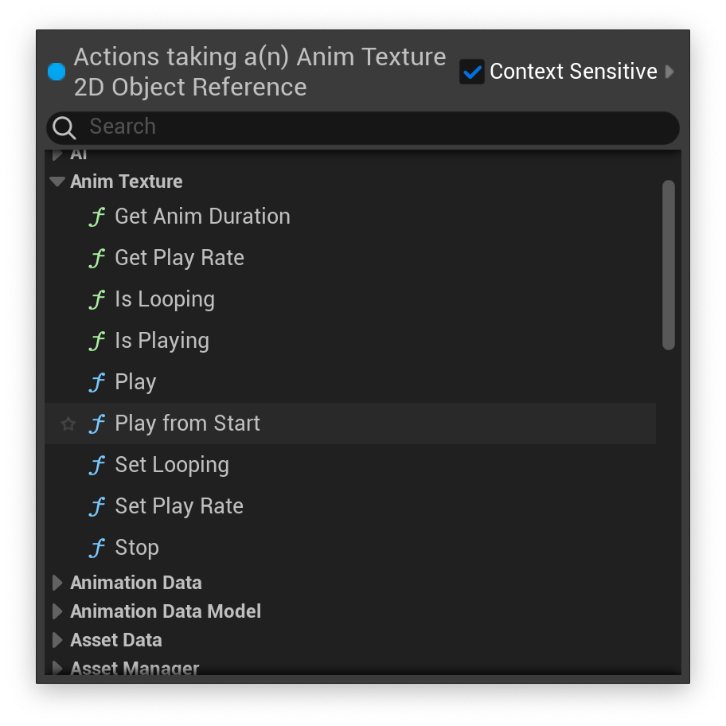

# Anim Texture Pro

## What is Anim Texture Pro?

Anim Texture Pro is a code plugin for UE5 that introduces a new texture resource type called **Anim Texture 2D**. Anim Texture 2D internally manages compressed animation data and provides efficient real-time decoding and animation playback during runtime. Anim Texture 2D can be utilized in any standard 2D texture application scenario, including materials, material instances, UMG widgets, and more.

## Creating an Anim Texture

With the Anim Texture Pro plugin, you can import `.gif` or `.webp` animation files into Unreal Editor to create Anim Texture 2D assets. Additionally, during runtime, you can load animation files in these formats from either local storage or the network to create Anim Texture 2D objects. The `.webp` format supports highly compressed **true-color animations**, while .gif supports classic 256-color palette-based animations.

### Importing `.gif` or `.webp` file

After enabling the plugin, simply drag and drop files with `.gif` or `.webp` extensions into the Content Browser of Unreal Editor, just as you would with regular textures. The plugin will automatically recognize them as Anim Texture 2D type and create the corresponding asset files.

You can modify the properties of Anim Texture within the Texture Editor.

### Loading file at runtime

This plugin provides two blueprint nodes that can be used to load `.gif` or `.webp` files at runtime and create Anim Texture 2D objects. One is for blocking mode loading, and the other is for asynchronous mode loading.

### Downloading file from web

This plugin also supports downloading `.gif` or `.webp` animation files from the network via the HTTP protocol.

## Using Anim Texture

Using Anim Texture 2D is very straightforward—essentially, it works just like the engine's standard `UTexture2D`. Additionally, for animation playback, this plugin provides a comprehensive Playback API.

### Using Anim Texture in Material

Anim Texture 2D can be used as a standard Texture Sample in materials:

It can also be used as a Texture parameter in a Material Instance：

### Using Anim Texture in UMG

Anim Texture can be used in the Brush of UMG Image and supports animation playback:

And the Playback API can be used to control the Anim Texture in the Image control:

### Animation Playback API

The Anim Texture 2D object provides the following Playback API:

